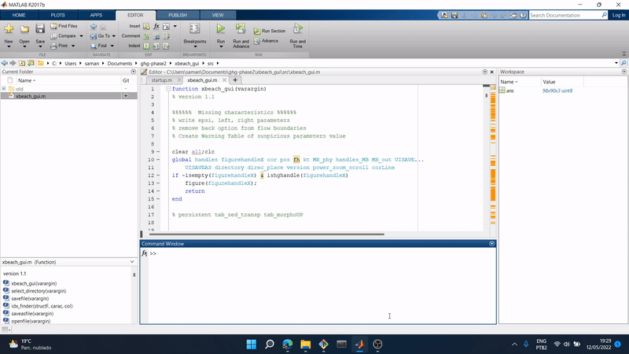

# Matlab XBeach GUI

XBeach is a two-dimensional model for wave propagation, long waves and mean flow, sediment transport and morphological changes of the nearshore area, beaches, dunes and backbarrier during storms. It is a public-domain model that has been developed with major funding from the US Army Corps of Engineers, Rijkswaterstaat and the EU, supported by a consortium of  UNESCO-IHE, Deltares (formerly WL|Delft Hydraulics), Delft University of Technology and the University of Miami.
[XBeach page link](https://oss.deltares.nl/web/xbeach/)

_2013 Project_
By [Gustavo Gomes](https://github.com/gustavo-gomes-ghg)

