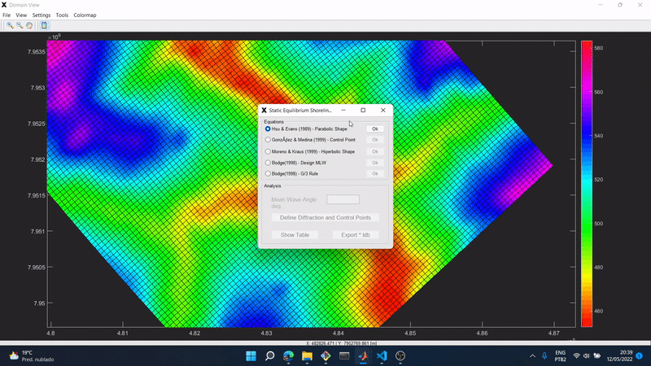
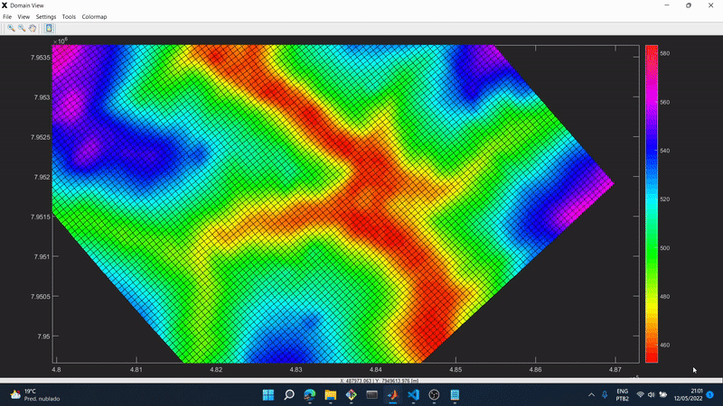
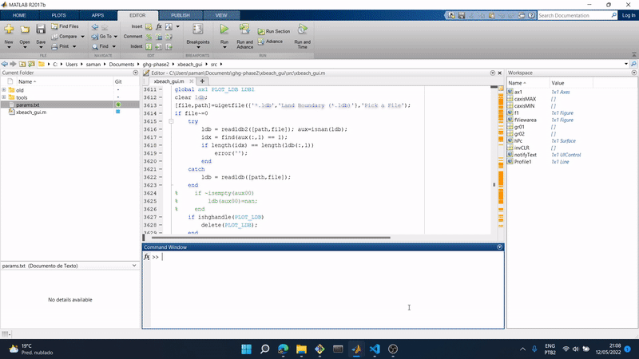

# Matlab XBeach GUI

XBeach is a two-dimensional model for wave propagation, long waves and mean flow, sediment transport and morphological changes of the nearshore area, beaches, dunes and backbarrier during storms. It is a public-domain model that has been developed with major funding from the US Army Corps of Engineers, Rijkswaterstaat and the EU, supported by a consortium of  UNESCO-IHE, Deltares (formerly WL|Delft Hydraulics), Delft University of Technology and the University of Miami.
[XBeach page link](https://oss.deltares.nl/web/xbeach/)

_2013 Project_
By [Gustavo Gomes](https://github.com/gustavo-gomes-ghg)

##
GUI for model setup

##
GUI - Visualization Area 1

##
GUI - Visualization Area 2 - Static Equilibrium Shoreline Analysis

##
GUI - Visualization Area 3 - Topography profile analysis

##
GUI - Visualization Area 4 - Land Boundary

## How to use
1) Open Matlab
2) Move to src directory `cd src/`
3) Run `xbeach_gui`

To open visualization area and analysis tools
1) On XBeach GUI, click on "Domain" button
2) Load grid file. On main project directory exists a folder named 'domain_example' with Delft3D grid example of an water reservoir on Brazil. Load 'cacu_curv.grd' file
3) Click on 'Bathymetry' button and load 'cacu_srtm.dep' file
4) Explore the menu toolbar to change colormap, topography/bathymetry limits, and other features, draw polygons, load land boundary files (.ldb)